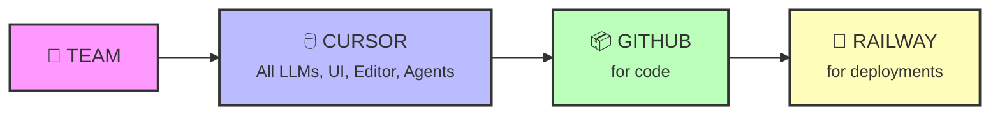

---
# You can also start simply with 'default'
theme: seriph
# random image from a curated Unsplash collection by Anthony
# like them? see https://unsplash.com/collections/94734566/slidev
background: https://images.unsplash.com/photo-1555066931-4365d14bab8c?w=1920
# some information about your slides (markdown enabled)
title: You don't have an excuse not to code now!
info: |
  ## How to harness vibe coding efficiently
  
  A tech talk about vibe coding capabilities, how we use it, and what's easiest. 
  If you are not a technical person or have not coded in a long time - it's definitely worth coming to try.
# apply unocss classes to the current slide
class: text-center
# https://sli.dev/features/drawing
drawings:
  persist: false
# slide transition: https://sli.dev/guide/animations.html#slide-transitions
transition: slide-left
# enable MDC Syntax: https://sli.dev/features/mdc
mdc: true
# open graph
# seoMeta:
#  ogImage: https://cover.sli.dev
---

# You don't have an excuse not to code now!


<div class="abs-br m-6 text-xl">
  <button @click="$slidev.nav.openInEditor()" title="Open in Editor" class="slidev-icon-btn">
    <carbon:edit />
  </button>
  <a href="https://github.com/slidevjs/slidev" target="_blank" class="slidev-icon-btn">
    <carbon:logo-github />
  </a>
</div>

<!--
The last comment block of each slide will be treated as slide notes. It will be visible and editable in Presenter Mode along with the slide. [Read more in the docs](https://sli.dev/guide/syntax.html#notes)
-->

---
transition: fade-out
---

# Agenda

<div class="space-y-8 mt-10">

<v-clicks>

<div>
<h3 class="text-2xl mb-2">Context</h3>
</div>

<div>
<h3 class="text-2xl mb-2">AXL Case</h3>
</div>

<div>
<h3 class="text-2xl mb-2">Lessons</h3>
</div>

</v-clicks>

</div>

---
layout: center
class: text-center
---

# Vibe coding have you hear it?

<div class="text-3xl mt-12">
Because this presentation was vibe coded as well! 🎉
</div>

---
layout: section
---

# Context

---

# Vibe coding

<div style="display: flex; flex-direction: row; align-items: flex-start; gap: 32px; justify-content: center; margin-bottom: 24px;">
  <div style="text-align: center;">
    
    <a href="https://www.thewayofcode.com/" target="_blank">thewayofcode.com</a>
  </div>
  <div style="text-align: center;">
    
    <a href="https://x.com/karpathy/status/1886192184808149383?lang=en" target="_blank">x.com/karpathy/status/1886192184808149383</a>
  </div>
</div>


---

# Products

<div class="grid grid-cols-3 gap-6 mt-8">

<div>

### ✏️ Editors

<div class="bg-green-50 p-4 rounded-lg">

**[Cursor](https://cursor.com/)**  
AI-first code editor

**[Windsurf](https://codeium.com/windsurf)**  
The IDE for AI agents

**[VS Code Copilot](https://code.visualstudio.com/)**  
GitHub's AI pair programmer

**[Zed](https://zed.dev/)**  
High-performance multiplayer editor

</div>

</div>

<div>

### 🤖 Agents

<div class="bg-blue-50 p-4 rounded-lg">

**[Cursor Agents](https://cursor.com/)**  
Autonomous coding agents

**[OpenAI Codex](https://openai.com/index/introducing-openai-o1-preview/)**  
Powers GitHub Copilot

**[Jules by Google](https://labs.google.com/jules)**  
AI coding companion

**[Claude Code](https://claude.ai/)**  
Anthropic's coding assistant

**[Gemini CLI](https://ai.google.dev/gemini-api/docs)**  
Google's AI in terminal

</div>

</div>

<div>

### 🎨 Apps

<div class="bg-pink-50 p-4 rounded-lg">

**[Lovable.dev](https://lovable.dev/)**  
Build apps with AI

**[Bolt.new](https://bolt.new/)**  
Full-stack web dev in browser

**[V0.dev](https://v0.dev/)**  
UI generation by Vercel

**[Gemini Canvas](https://aistudio.google.com/)**  
Google's AI workspace

</div>

</div>

</div>

<div class="text-center text-sm text-gray-400 mt-4">
Click on any tool to learn more
</div>

---

# Products

<div class="relative">

<!-- Main grid with arrows overlay -->
<div class="grid grid-cols-3 gap-4 mt-6">

<div>

### ✏️ Editors

<div class="bg-green-50 p-3 rounded-lg text-sm">

**[Cursor](https://cursor.com/)**  
AI-first code editor

**[Windsurf](https://codeium.com/windsurf)**  
The IDE for AI agents

**[VS Code Copilot](https://code.visualstudio.com/)**  
GitHub's AI pair programmer

**[Zed](https://zed.dev/)**  
High-performance multiplayer

</div>

</div>

<div>

### 🤖 Agents

<div class="bg-blue-50 p-3 rounded-lg text-sm">

**[Cursor Agents](https://cursor.com/)**  
Autonomous coding agents

**[OpenAI Codex](https://openai.com/index/introducing-openai-o1-preview/)**  
Powers GitHub Copilot

**[Jules by Google](https://labs.google.com/jules)**  
AI coding companion

**[Claude Code](https://claude.ai/)**  
Anthropic's coding assistant

**[Gemini CLI](https://ai.google.dev/gemini-api/docs)**  
Google's AI in terminal

</div>

</div>

<div>

### 🎨 Apps

<div class="bg-pink-50 p-3 rounded-lg text-sm">

**[Lovable.dev](https://lovable.dev/)**  
Build apps with AI

**[Bolt.new](https://bolt.new/)**  
Full-stack web dev

**[V0.dev](https://v0.dev/)**  
UI generation by Vercel

**[Gemini Canvas](https://aistudio.google.com/)**  
Google's AI workspace

</div>

</div>

</div>

<!-- Connection arrows -->
<div class="flex justify-center mt-6 text-2xl">
<span class="text-green-500">Editors</span>
<span class="mx-2">→</span>
<span class="text-blue-500">Agents</span>
<span class="mx-2">←</span>
<span class="text-pink-500">Apps</span>
<span class="mx-2">→</span>
<span class="text-green-500">Editors</span>
</div>

<div class="text-center text-xs text-gray-600 mt-2">
The ecosystem is interconnected - Apps feed both Editors and Agents, Editors integrate with Agents
</div>

</div>

---
layout: section
---

# AXL Case

---

# ML team setup

<div class="grid grid-cols-2 gap-4 mt-2">

<div class="space-y-2">
<div>

<a href="https://www.linkedin.com/posts/tovi-grossman-40430166_today-im-thrilled-to-share-the-public-launch-activity-7340741771095678980-_Q0W/" target="_blank" class="text-xs text-blue-600 hover:text-blue-800">
AXL Launch
</a>
</div>

<div>

<a href="https://www.dentons.com/en/about-dentons/news-events-and-awards/news/2025/june/dentons-and-axl-announce-strategic-partnership-to-advance-legal-innovation-with-ai" target="_blank" class="text-xs text-blue-600 hover:text-blue-800">
Dentons Partnership
</a>
</div>
</div>

<div class="flex items-center">
<div>
<h3 class="text-lg font-bold mb-2">New Venture Studio in Toronto focused on HCI</h3>
<p class="text-sm mb-3">(Human Computer Interaction)</p>

<div class="text-sm">
<p class="font-semibold mb-2">Goals to setup ML team:</p>
<ul class="space-y-1 ml-3">
<li>• Build prototypes</li>
<li>• Work with portfolio companies</li>
<li>• Collaborate with corporate partners</li>
</ul>
</div>
</div>
</div>

</div>

---

# Flow

<div class="grid grid-cols-2 gap-8 mt-4">

<div>
<h3 class="text-2xl font-bold mb-4">ML team</h3>

<ul class="space-y-2 text-lg">
<li>• 4 interns</li>
<li>• 1 full stack</li>
<li>• 2 designers</li>
</ul>

<div class="mt-6">
<p class="text-lg font-semibold">AI coding tools: Team Plan Cursor</p>
</div>
</div>


<div>
<h3 class="text-2xl font-bold mb-4">Process</h3>

<p class="text-lg font-semibold mb-4">Each project = Code + One Pager + Deployment</p>



</div>

</div>

---

# Stats Cursors

<div class="grid grid-cols-3 gap-4 mt-4">

<div class="text-center">

</div>

<div class="text-center">

</div>

<div class="text-center">

</div>

</div>

---

# Stats Github

---

# Results

<div class="mt-4">

<h3 class="text-xl font-bold mb-4">Timeline: 2.5 months</h3>

<div class="space-y-2 text-sm">

<div class="p-2 bg-green-50 rounded">
<p class="font-semibold">✅ 1 production deployment</p>
</div>

<div class="p-2 bg-blue-50 rounded">
<p class="font-semibold">📋 Intake process for companies: 100 companies used so far</p>
</div>

<div class="p-2 bg-purple-50 rounded">
<p class="font-semibold">🚀 1 semi-production deployment</p>
</div>

<div class="p-2 bg-yellow-50 rounded">
<p class="font-semibold">📰 Newsletter</p>
</div>

<div class="p-2 bg-gray-50 rounded">
<p class="font-semibold">🔬 3 POCs on sidelines & internal use & additional testing</p>
</div>

</div>

</div>

---

# Vibe coding ways

<div class="mt-2">


<div class="grid grid-cols-4 gap-3 mt-4">

<div v-click class="text-center">
<div class="text-2xl mb-1">💬</div>
<p class="text-sm font-bold">From Slack!</p>
</div>

<div v-click class="text-center">
<div class="text-2xl mb-1">📱</div>
<p class="text-sm font-bold">From Mobile</p>
</div>

<div v-click class="text-center">
<div class="text-2xl mb-1">🌐</div>
<p class="text-sm font-bold">From Web</p>
</div>

<div v-click class="text-center">
<div class="text-2xl mb-1">🚫💻</div>
<p class="text-sm font-bold">No Computer!</p>
</div>

</div>


<div v-click class="mt-3 p-2 bg-gray-100 rounded">
<p class="text-sm font-bold">📋 Example: Tovi's IP request</p>
<p class="text-xs text-gray-600">Try it 3 ways: Slack, Web, Mobile</p>
</div>

</div>

---

# Pattern 1: Slack

<div class="mt-4">

<div class="text-lg mb-6">
<strong>Just message Cursor in Slack like you would message your colleagues!</strong>
</div>

<div v-click>

### 📝 Process:
1. Join **#ml-team-vibe-coding** slack channel
2. Write `@Cursor repo=<ask if need help> "Write what you want to do"`
3. Wait till green checkmark ✅
4. Ask eng to review & see preview of your changes
5. Iterate (my conversations are very very long running)

</div>

<div v-click class="mt-6 p-4 bg-gray-100 rounded-lg">

### 💡 Example (copy this):

```
@Cursor repo=axl-lab/teach-ai "We're working with the X team for the next two weeks during the hackathon. X is an educational company that helps students better prepare for programming assignments. The product centers around a course structure—its materials, relevant sources, and collaborative tools—to support students in learning effectively without revealing the actual answers. It's essentially a "Study Together" feature.
Based on the existing codebase, which intellectual property components, features, and code segments can be reused for the X team?
Please provide a level of effort (LoE) estimate for the reusability of each module and function as a separate package."
```

</div>

</div>

---

# Pattern 2: Web

<div class="flex gap-8 mt-4">

<div class="flex-1">

<div class="text-lg mb-6">
<strong>Use Cursor's web interface for a more visual experience!</strong>
</div>

<div v-click>

### 📝 Process:
1. Go to https://cursor.com/agents
2. Select repo you want to work on (usually one per project)
3. Ask in chat style what you want
4. Ask eng to review & see preview of your changes
5. Iterate

</div>

</div>

<div v-click class="flex-shrink-0">

</div>

</div>

---

# Pattern 3: Mobile

<div class="flex gap-8 mt-4">

<div class="flex-1">

<div class="text-lg mb-6">
<strong>Code on the go - no laptop required! 📱</strong>
</div>

<div v-click>

### 📝 Process:
1. Go to https://cursor.com/agents on your phone
2. Select repo you want to work on (usually one per project)
3. Ask in chat style what you want
4. Ask eng to review & see preview of your changes
5. Iterate - even from the beach! 🏖️

</div>

<div v-click class="mt-4 p-3 bg-green-50 rounded-lg">
<p class="text-sm">💡 Perfect for quick fixes, reviewing code, or when inspiration strikes during your commute!</p>
</div>

</div>

<div v-click class="flex-shrink-0">

</div>

</div>

---
layout: section
---

# Lessons

---

# accelerate

---

# agent on a leash

---

# better abstractions

---

# real costs is ownership
