---
# You can also start simply with 'default'
theme: seriph
# random image from a curated Unsplash collection by Anthony
# like them? see https://unsplash.com/collections/94734566/slidev
background: https://images.unsplash.com/photo-1555066931-4365d14bab8c?w=1920
# some information about your slides (markdown enabled)
title: You don't have an excuse not to code now!
info: |
  ## How to harness vibe coding efficiently
  
  A tech talk about vibe coding capabilities, how we use it, and what's easiest. 
  If you are not a technical person or have not coded in a long time - it's definitely worth coming to try.
# apply unocss classes to the current slide
class: text-center
# https://sli.dev/features/drawing
drawings:
  persist: false
# slide transition: https://sli.dev/guide/animations.html#slide-transitions
transition: slide-left
# enable MDC Syntax: https://sli.dev/features/mdc
mdc: true
# open graph
# seoMeta:
#  ogImage: https://cover.sli.dev
---

# You don't have an excuse not to code now!

  <button @click="$slidev.nav.openInEditor()" title="Open in Editor" class="slidev-icon-btn">
    <carbon:edit />
  </button>
  <a href="https://github.com/slidevjs/slidev" target="_blank" class="slidev-icon-btn">
    <carbon:logo-github />
  </a>

<!--
The last comment block of each slide will be treated as slide notes. It will be visible and editable in Presenter Mode along with the slide. [Read more in the docs](https://sli.dev/guide/syntax.html#notes)
-->

---
transition: fade-out
---

# Agenda

<v-clicks>

<h3 class="text-2xl mb-2">🌟 Gentle intro</h3>

Market review of vibe coding tools and capabilities

<h3 class="text-2xl mb-2">🌉 Mind the GAP</h3>

What is the gap between real product & vibe coded solutions

<h3 class="text-2xl mb-2">🏢 AXL</h3>

How do we use it and how should we use it at AXL

</v-clicks>

---
layout: center
class: text-center
---

# Why not AXL standard template?

Because this presentation was vibe coded as well! 🎉

---
layout: section
---

# Gentle intro

Market review

---

# Vibe coding

  

    
    <a href="https://www.thewayofcode.com/" target="_blank">thewayofcode.com</a>
  

  

    
    <a href="https://x.com/karpathy/status/1886192184808149383?lang=en" target="_blank">x.com/karpathy/status/1886192184808149383</a>
  

---

# LLMs are good at code

  

    
    <a href="https://github.com/swe-bench/SWE-bench" target="_blank">github.com/swe-bench/SWE-bench</a>
  

  

    
    <a href="https://aider.chat/docs/leaderboards/" target="_blank">aider.chat/docs/leaderboards/</a>
  

---

# Devs are using it a lot!

  
  <a href="https://www.anthropic.com/news/the-anthropic-economic-index" target="_blank">anthropic.com/news/the-anthropic-economic-index</a>

---

# Market reacts

  
  <a href="https://www.redpoint.com/infrared/report/" target="_blank">redpoint.com/infrared/report/</a>

---

# Sometimes in a bad way

  

    
    <a href="https://www.answer.ai/posts/2025-01-08-devin.html" target="_blank">answer.ai/posts/2025-01-08-devin.html</a>
  

  

    
    <a href="https://www.youtube.com/watch?v=tNmgmwEtoWE" target="_blank">youtube.com/watch?v=tNmgmwEtoWE</a>
  

---

# But usually with good products

```mermaid
graph TD
    subgraph Products["🎨 Products"]
        P1[Lovable.dev]
        P2[Bolt.new]
        P3[V0.dev]
        P4[Gemini Canvas]
    end
    
    subgraph Agents["🤖 Agents"]
        A1[Cursor Agents]
        A2[OpenAI Codex]
        A3[Jules by Google]
        A4[Claude Code]
        A5[Gemini CLI]
    end
    
    subgraph Editors["✏️ Editors"]
        E1[Cursor]
        E2[Windsurf]
        E3[VS Code Copilot]
        E4[Zed]
    end
    
    click P1 "https://lovable.dev/" _blank
    click P2 "https://bolt.new/" _blank
    click P3 "https://v0.dev/" _blank
    click P4 "https://gemini.google.com/overview/canvas/" _blank
    
    click A1 "https://cursor.com/agents" _blank
    click A2 "https://openai.com/index/introducing-codex/" _blank
    click A3 "https://jules.google/" _blank
    click A4 "https://www.anthropic.com/claude-code" _blank
    click A5 "https://github.com/google-gemini/gemini-cli" _blank
    
    click E1 "https://cursor.com/" _blank
    click E2 "https://windsurf.com/editor" _blank
    click E3 "https://github.com/microsoft/vscode-copilot-chat" _blank
    click E4 "https://github.com/zed-industries/zed" _blank
    
    style Products fill:#f9f,stroke:#333,stroke-width:2px
    style Agents fill:#bbf,stroke:#333,stroke-width:2px
    style Editors fill:#bfb,stroke:#333,stroke-width:2px
```

Click on any tool name to learn more

---

# But usually with good products

The ecosystem is interconnected - Products generate code for Editors, Editors integrate with Agents

---

# Ideas to try with Bolt.new

<strong>💀 DeathClock.lol</strong> 
Lifestyle → death countdown with sass

<strong>🤡 RoastMyStartup.ai</strong> 
Get your startup idea demolished

<strong>🔥 BurnItDown.club</strong> 
Watch things you hate burn virtually

<strong>👻 GhostYourself.io</strong> 
Generate elaborate excuses instantly

<strong>🭠UnhingedLinkedIn.com</strong> 
LinkedIn but brutally honest

<strong>🌶️ ToxicOrFlirting.game</strong> 
AI judges your text screenshots

<strong>🪠ExistentialCrisis.chat</strong> 
Simple questions → reality crisis

<strong>🔮 FortuneCookie.wtf</strong> 
Gen Z chaos fortune cookies

🚀 Build any of these in an afternoon!

---
layout: section
---

# Mind the GAP

What is the gap between real product & vibe coded solutions

---

# How wide is the gap?

---

# Cost of software

---

# Vibe coding - depends on taste

Taste comes with practice

---

# Better abstractions

---

# Accelerate for AI coding

---

# Rule of thumb

---
layout: section
---

# AXL way

How do we use it and how should we use it at AXL

---

# Pre-requisites

**Each project = Code + One Pager + Running version**

### 📁 GitHub - Code Storage
- **REPO**: Specific code location for project
- **PR (Pull Request)**: Atomic set of work
  - Can be reviewed ✓
  - Can be accepted ✅
  - Can be rejected ❌
- **REPO updated via PR**

### 🚀 Automation & Access
- **CI/CD**: Automation to move updated code to live
- **Deployment**: Where you access it
  - Railway in our case 🚂

---

# Our setup

```mermaid
graph LR
    TEAM[👥 TEAM] --> CURSOR[🖱️ CURSOR<br/><small>All LLMs, UI, Editor, Agents</small>]
    CURSOR --> GITHUB[📦 GITHUB<br/><small>for code</small>]
    GITHUB --> RAILWAY[🚂 RAILWAY<br/><small>for deployments</small>]
    
    style TEAM fill:#f9f,stroke:#333,stroke-width:2px
    style CURSOR fill:#bbf,stroke:#333,stroke-width:2px
    style GITHUB fill:#bfb,stroke:#333,stroke-width:2px
    style RAILWAY fill:#ffb,stroke:#333,stroke-width:2px
```

---

# Cursor stats

<a href="https://cursor.com/analytics" target="_blank" class="text-blue-500 hover:text-blue-700 hover:underline font-semibold">
📊 View full analytics at cursor.com/analytics →
</a>

---

# Team opinion

🎤

<h2 class="text-3xl mb-8">Let's share our experience about vibe coding with Cursor</h2>

What worked? What didn't? What surprised you?

---

# Ideal state

<h2 class="text-2xl text-center mb-8">I want everyone from AXL to contribute code!</h2>

📱

<h3 class="text-lg font-bold">From Mobile</h3>

🌐

<h3 class="text-lg font-bold">From Web</h3>

🚫💻

<h3 class="text-lg font-bold">No Computer Needed!</h3>

<h3 class="text-lg font-bold mb-2">📋 Example: Tovi's request about potential IP for CodeAid</h3>

Let's use it as example in 3 ways: Slack, Dashboard, Mobile

---

# Option 1: Slack

---

# Option 2: Dashboard

---

# Option 3: Mobile
