```mermaid
graph LR
    TEAM[👥 TEAM] --> CURSOR[🖱️ CURSOR<br/><small>All LLMs, UI, Editor, Agents</small>]
    CURSOR --> GITHUB[📦 GITHUB<br/><small>for code</small>]
    GITHUB --> RAILWAY[🚂 RAILWAY<br/><small>for deployments</small>]
    
    style TEAM fill:#f9f,stroke:#333,stroke-width:2px
    style CURSOR fill:#bbf,stroke:#333,stroke-width:2px
    style GITHUB fill:#bfb,stroke:#333,stroke-width:2px
    style RAILWAY fill:#ffb,stroke:#333,stroke-width:2px
```

---
# You can also start simply with 'default'
theme: seriph
# random image from a curated Unsplash collection by Anthony
# like them? see https://unsplash.com/collections/94734566/slidev
background: https://images.unsplash.com/photo-1555066931-4365d14bab8c?w=1920
# some information about your slides (markdown enabled)
title: You don't have an excuse not to code now!
info: |
  ## How to harness vibe coding efficiently
  
  A tech talk about vibe coding capabilities, how we use it, and what's easiest. 
  If you are not a technical person or have not coded in a long time - it's definitely worth coming to try.
# apply unocss classes to the current slide
class: text-center
# https://sli.dev/features/drawing
drawings:
  persist: false
# slide transition: https://sli.dev/guide/animations.html#slide-transitions
transition: slide-left
# enable MDC Syntax: https://sli.dev/features/mdc
mdc: true
# open graph
# seoMeta:
#  ogImage: https://cover.sli.dev
---

# You don't have an excuse not to code now!

  <button @click="$slidev.nav.openInEditor()" title="Open in Editor" class="slidev-icon-btn">
    <carbon:edit />
  </button>
  <a href="https://github.com/slidevjs/slidev" target="_blank" class="slidev-icon-btn">
    <carbon:logo-github />
  </a>

<!--
The last comment block of each slide will be treated as slide notes. It will be visible and editable in Presenter Mode along with the slide. [Read more in the docs](https://sli.dev/guide/syntax.html#notes)
-->

---
transition: fade-out
---

# Agenda

<v-clicks>

<h3 class="text-2xl mb-2">Context</h3>

<h3 class="text-2xl mb-2">AXL Case</h3>

<h3 class="text-2xl mb-2">Lessons</h3>

</v-clicks>

---
layout: center
class: text-center
---

# Vibe coding have you hear it?

Because this presentation was vibe coded as well! 🎉

---
layout: section
---

# Context

---

# Vibe coding

  

    
    <a href="https://www.thewayofcode.com/" target="_blank">thewayofcode.com</a>
  

  

    
    <a href="https://x.com/karpathy/status/1886192184808149383?lang=en" target="_blank">x.com/karpathy/status/1886192184808149383</a>
  

---

# Products

### ✏️ Editors

**[Cursor](https://cursor.com/)**  
AI-first code editor

**[Windsurf](https://codeium.com/windsurf)**  
The IDE for AI agents

**[VS Code Copilot](https://code.visualstudio.com/)**  
GitHub's AI pair programmer

**[Zed](https://zed.dev/)**  
High-performance multiplayer editor

### 🤖 Agents

**[Cursor Agents](https://cursor.com/)**  
Autonomous coding agents

**[OpenAI Codex](https://openai.com/index/introducing-openai-o1-preview/)**  
Powers GitHub Copilot

**[Jules by Google](https://labs.google.com/jules)**  
AI coding companion

**[Claude Code](https://claude.ai/)**  
Anthropic's coding assistant

**[Gemini CLI](https://ai.google.dev/gemini-api/docs)**  
Google's AI in terminal

### 🎨 Apps

**[Lovable.dev](https://lovable.dev/)**  
Build apps with AI

**[Bolt.new](https://bolt.new/)**  
Full-stack web dev in browser

**[V0.dev](https://v0.dev/)**  
UI generation by Vercel

**[Gemini Canvas](https://aistudio.google.com/)**  
Google's AI workspace

Click on any tool to learn more

---

# Products

<!-- Main grid with arrows overlay -->

### ✏️ Editors

**[Cursor](https://cursor.com/)**  
AI-first code editor

**[Windsurf](https://codeium.com/windsurf)**  
The IDE for AI agents

**[VS Code Copilot](https://code.visualstudio.com/)**  
GitHub's AI pair programmer

**[Zed](https://zed.dev/)**  
High-performance multiplayer

### 🤖 Agents

**[Cursor Agents](https://cursor.com/)**  
Autonomous coding agents

**[OpenAI Codex](https://openai.com/index/introducing-openai-o1-preview/)**  
Powers GitHub Copilot

**[Jules by Google](https://labs.google.com/jules)**  
AI coding companion

**[Claude Code](https://claude.ai/)**  
Anthropic's coding assistant

**[Gemini CLI](https://ai.google.dev/gemini-api/docs)**  
Google's AI in terminal

### 🎨 Apps

**[Lovable.dev](https://lovable.dev/)**  
Build apps with AI

**[Bolt.new](https://bolt.new/)**  
Full-stack web dev

**[V0.dev](https://v0.dev/)**  
UI generation by Vercel

**[Gemini Canvas](https://aistudio.google.com/)**  
Google's AI workspace

<!-- Connection arrows -->

Editors
→
Agents
←
Apps
→
Editors

The ecosystem is interconnected - Apps feed both Editors and Agents, Editors integrate with Agents

---
layout: section
---

# AXL Case

---

# ML team setup

<a href="https://www.linkedin.com/posts/tovi-grossman-40430166_today-im-thrilled-to-share-the-public-launch-activity-7340741771095678980-_Q0W/" target="_blank" class="text-xs text-blue-600 hover:text-blue-800">
AXL Launch
</a>

<a href="https://www.dentons.com/en/about-dentons/news-events-and-awards/news/2025/june/dentons-and-axl-announce-strategic-partnership-to-advance-legal-innovation-with-ai" target="_blank" class="text-xs text-blue-600 hover:text-blue-800">
Dentons Partnership
</a>

<h3 class="text-lg font-bold mb-2">New Venture Studio in Toronto focused on HCI</h3>

(Human Computer Interaction)

Goals to setup ML team:

<ul class="space-y-1 ml-3">
<li>• Build prototypes</li>
<li>• Work with portfolio companies</li>
<li>• Collaborate with corporate partners</li>
</ul>

---

# Flow

<h3 class="text-2xl font-bold mb-4">ML team</h3>

<ul class="space-y-2 text-lg">
<li>• 4 interns</li>
<li>• 1 full stack</li>
<li>• 2 designers</li>
</ul>

AI coding tools: Team Plan Cursor

<h3 class="text-2xl font-bold mb-4">Process</h3>

Each project = Code + One Pager + Deployment

---

# Stats Cursors

---

# Stats Github

---

# Results

<h3 class="text-xl font-bold mb-4">Timeline: 2.5 months</h3>

✅ 1 production deployment

📋 Intake process for companies: 100 companies used so far

🚀 1 semi-production deployment

📰 Newsletter

🔬 3 POCs on sidelines & internal use & additional testing

---

# Vibe coding ways

---
layout: section
---

# Lessons

---

# accelerate

---

# agent on a leash

---

# better abstractions

---

# rest costs is ownership
