```mermaid
graph LR
    TEAM[👥 TEAM] --> CURSOR[🖱️ CURSOR<br/><small>All LLMs, UI, Editor, Agents</small>]
    CURSOR --> GITHUB[📦 GITHUB<br/><small>for code</small>]
    GITHUB --> RAILWAY[🚂 RAILWAY<br/><small>for deployments</small>]
    
    style TEAM fill:#f9f,stroke:#333,stroke-width:2px
    style CURSOR fill:#bbf,stroke:#333,stroke-width:2px
    style GITHUB fill:#bfb,stroke:#333,stroke-width:2px
    style RAILWAY fill:#ffb,stroke:#333,stroke-width:2px
```

---
# You can also start simply with 'default'
theme: seriph
# random image from a curated Unsplash collection by Anthony
# like them? see https://unsplash.com/collections/94734566/slidev
background: https://images.unsplash.com/photo-1555066931-4365d14bab8c?w=1920
# some information about your slides (markdown enabled)
title: You don't have an excuse not to code now!
info: |
  ## How to harness vibe coding efficiently
  
  A tech talk about vibe coding capabilities, how we use it, and what's easiest. 
  If you are not a technical person or have not coded in a long time - it's definitely worth coming to try.
# apply unocss classes to the current slide
class: text-center
# https://sli.dev/features/drawing
drawings:
  persist: false
# slide transition: https://sli.dev/guide/animations.html#slide-transitions
transition: slide-left
# enable MDC Syntax: https://sli.dev/features/mdc
mdc: true
# open graph
# seoMeta:
#  ogImage: https://cover.sli.dev
---

# You don't have an excuse not to code now!

<div class="abs-tr m-4">
  
</div>

<div class="abs-br m-6 text-xl">
  <button @click="$slidev.nav.openInEditor()" title="Open in Editor" class="slidev-icon-btn">
    <carbon:edit />
  </button>
  <a href="https://github.com/slidevjs/slidev" target="_blank" class="slidev-icon-btn">
    <carbon:logo-github />
  </a>
</div>

<!--
The last comment block of each slide will be treated as slide notes. It will be visible and editable in Presenter Mode along with the slide. [Read more in the docs](https://sli.dev/guide/syntax.html#notes)
-->

---
transition: fade-out
---

# Agenda

<div class="abs-tr m-4">
  
</div>

<div class="space-y-8 mt-10">

<v-clicks>

<div>
<h3 class="text-2xl mb-2">Gentle intro</h3>
<p class="text-gray-400">Market review of vibe coding tools and capabilities</p>
</div>

<div>
<h3 class="text-2xl mb-2">Mind the GAP</h3>
<p class="text-gray-400">What is the gap between real product & vibe coded solutions</p>
</div>

<div>
<h3 class="text-2xl mb-2">Real use-case</h3>
<p class="text-gray-400">How do we use it and how should we use it at Venture Studio</p>
</div>

<div>
<h3 class="text-2xl mb-2">Lessons</h3>
<p class="text-gray-400">Reusable parts</p>
</div>

</v-clicks>

</div>

---

<div class="w-full h-full flex items-center justify-center relative">
  
  <div class="absolute top-8 left-0 right-0 text-center">
    <h1 class="text-6xl font-bold text-white drop-shadow-lg">Gentle intro</h1>
  </div>
  <div class="absolute top-4 right-4">
    
  </div>
</div>

---

# Vibe coding

<div class="abs-tr m-4">
  
</div>

<div style="display: flex; flex-direction: row; align-items: flex-start; gap: 32px; justify-content: center; margin-bottom: 24px;">
  <div style="text-align: center;">
    
    <a href="https://www.thewayofcode.com/" target="_blank">thewayofcode.com</a>
  </div>
  <div style="text-align: center;">
    
    <a href="https://x.com/karpathy/status/1886192184808149383?lang=en" target="_blank">x.com/karpathy/status/1886192184808149383</a>
  </div>
</div>

---

# LLMs are good at code

<div class="abs-tr m-4">
  
</div>

<div style="display: flex; flex-direction: row; align-items: flex-start; gap: 32px; justify-content: center; margin-bottom: 24px;">
  <div style="text-align: center;">
    
    <a href="https://github.com/swe-bench/SWE-bench" target="_blank">github.com/swe-bench/SWE-bench</a>
  </div>
  <div style="text-align: center;">
    
    <a href="https://aider.chat/docs/leaderboards/" target="_blank">aider.chat/docs/leaderboards/</a>
  </div>
</div>

---

# Devs are using it a lot!

<div class="abs-tr m-4">
  
</div>

<div style="text-align: center; margin-bottom: 16px;">
  
  <a href="https://www.anthropic.com/news/the-anthropic-economic-index" target="_blank">anthropic.com/news/the-anthropic-economic-index</a>
</div>

---

# Market reacts

<div class="abs-tr m-4">
  
</div>

<div style="text-align: center; margin-bottom: 16px;">
  
  <a href="https://www.redpoint.com/infrared/report/" target="_blank">redpoint.com/infrared/report/</a>
</div>

---

# Sometimes in a bad way

<div class="abs-tr m-4">
  
</div>

<div style="display: flex; flex-direction: row; align-items: flex-start; gap: 32px; justify-content: center; margin-bottom: 24px;">
  <div style="text-align: center;">
    
    <a href="https://www.answer.ai/posts/2025-01-08-devin.html" target="_blank">answer.ai/posts/2025-01-08-devin.html</a>
  </div>
  <div style="text-align: center;">
    
    <a href="https://www.youtube.com/watch?v=tNmgmwEtoWE" target="_blank">youtube.com/watch?v=tNmgmwEtoWE</a>
  </div>
</div>

---

# But usually with good products

<div class="abs-tr m-4">
  
</div>

<div class="grid grid-cols-3 gap-6 mt-8">

<div>

### ✏️ Editors

<div class="bg-green-50 p-3 rounded-lg text-sm">

**[Cursor](https://cursor.com/)**  
AI-first code editor

**[Windsurf](https://codeium.com/windsurf)**  
The IDE for AI agents

**[VS Code Copilot](https://code.visualstudio.com/)**  
GitHub's AI pair programmer

**[Zed](https://zed.dev/)**  
High-performance multiplayer editor

**[Kiro](https://kiro.dev/)**  
Agentic IDE for production code

</div>

</div>

<div>

### 🤖 Agents

<div class="bg-blue-50 p-3 rounded-lg text-sm">

**[Cursor Agents](https://cursor.com/)**  
Autonomous coding agents

**[OpenAI Codex](https://openai.com/index/introducing-openai-o1-preview/)**  
Powers GitHub Copilot

**[Jules by Google](https://labs.google.com/jules)**  
AI coding companion

**[Claude Code](https://claude.ai/)**  
Anthropic's coding assistant

**[Devin](https://devin.ai/)**  
AI software engineer

</div>

</div>

<div>

### 🎨 Apps

<div class="bg-pink-50 p-3 rounded-lg text-sm">

**[Lovable.dev](https://lovable.dev/)**  
Build apps with AI

**[Bolt.new](https://bolt.new/)**  
Full-stack web dev in browser

**[V0.dev](https://v0.dev/)**  
UI generation by Vercel

**[Replit](https://replit.com/)**  
Code, create, and learn together

**[Spark](https://github.com/features/spark)**  
Dream it. See it. Ship it.

</div>

</div>

</div>

<div class="text-center text-sm text-gray-400 mt-4">
Click on any tool to learn more
</div>

---

# But usually with good products

<div class="abs-tr m-4">
  
</div>

<div class="relative">

<!-- Main grid with arrows overlay -->
<div class="grid grid-cols-3 gap-2 mt-2">

<div>

### ✏️ Editors

<div class="bg-green-50 p-1 rounded text-xs">

**[Cursor](https://cursor.com/)**  
**[Windsurf](https://codeium.com/windsurf)**  
**[VS Code Copilot](https://code.visualstudio.com/)**  
**[Zed](https://zed.dev/)**  
**[Kiro](https://kiro.dev/)**  

</div>

</div>

<div>

### 🤖 Agents

<div class="bg-blue-50 p-1 rounded text-xs">

**[Cursor Agents](https://cursor.com/)**  
**[OpenAI Codex](https://openai.com/index/introducing-openai-o1-preview/)**  
**[Jules by Google](https://labs.google.com/jules)**  
**[Claude Code](https://claude.ai/)**  
**[Gemini CLI](https://ai.google.dev/gemini-api/docs)**  
**[Devin](https://devin.ai/)**  

</div>

</div>

<div>

### 🎨 Apps

<div class="bg-pink-50 p-1 rounded text-xs">

**[Lovable.dev](https://lovable.dev/)**  
**[Bolt.new](https://bolt.new/)**  
**[V0.dev](https://v0.dev/)**  
**[Replit](https://replit.com/)**  
**[Gemini Canvas](https://aistudio.google.com/)**  
**[Spark](https://github.com/features/spark)**  

</div>

</div>

</div>

<!-- Connection arrows -->
<div class="flex justify-center mt-4 text-xl">
<span class="text-green-500 font-bold">Editors</span>
<span class="mx-2">→</span>
<span class="text-blue-500 font-bold">Agents</span>
<span class="mx-2">←</span>
<span class="text-pink-500 font-bold">Products</span>
<span class="mx-2">→</span>
<span class="text-green-500 font-bold">Editors</span>
</div>

<div class="text-center text-sm text-gray-600 mt-2">
The ecosystem is interconnected - Products feed both Editors and Agents, Editors integrate with Agents
</div>

</div>

---


# Examples with Bolt.new

<div class="abs-tr m-4">
  
</div>

<div class="mt-4">

<div v-click>

### <a href="https://magical-toffee-c28548.netlify.app/" target="_blank" class="text-blue-500 hover:underline">Mini Salesforce CRM</a>

```
Build a CRM like Salesforce but simpler. Include customer profiles, deal pipeline with drag-and-drop stages, contact management, activity tracking, and sales dashboard with charts. Add lead scoring, email templates, and task reminders for follow-ups.
```

</div>

<div v-click class="mt-6">

### <a href="https://remarkable-marigold-ae2b03.netlify.app/" target="_blank" class="text-blue-500 hover:underline">Pet Mood Predictor</a>

```
Create a pet mood prediction app that uses "advanced AI" to predict if your pet is happy, plotting world domination, or judging your life choices. Input factors like room temperature, your outfit, what you had for breakfast, and lunar phase. Include mood charts, pet therapy recommendations, and a "pet translator" feature.
```

</div>

<div v-click class="mt-6">

### <a href="https://statuesque-hotteok-83261c.netlify.app/" target="_blank" class="text-blue-500 hover:underline">Pizza Conspiracy Generator</a>

```
Build a pizza conspiracy theory generator. Users input their delivery time, toppings, and weather conditions to get elaborate conspiracy theories about why their pizza is late. Include CIA involvement, alien abductions, secret pizza illuminati, and a "evidence board" with red strings connecting random facts. Add a pizza tracker that gets increasingly paranoid.
```

</div>

</div>

<div v-click class="mt-6 text-center text-sm">
Copy a prompt and paste into Bolt.new to build in minutes!
</div>

---

<div class="w-full h-full flex items-center justify-center relative">
  
  <div class="absolute top-32 left-0 right-0 text-center">
    <h1 class="text-6xl font-bold text-white drop-shadow-lg">Mind the GAP</h1>
  </div>
  <div class="absolute top-4 right-4">
    
  </div>
</div>

---

# How wide is the gap?

<div class="abs-tr m-4">
  
</div>

<div class="grid grid-cols-2 gap-4 mt-2">

<div class="text-center">

</div>

<div class="text-center">

<a href="https://pivot-to-ai.com/2025/05/13/if-ai-is-so-good-at-coding-where-are-the-open-source-contributions/" target="_blank" class="text-xs text-blue-500 hover:underline">
pivot-to-ai.com
</a>
</div>

</div>

<div class="mt-6">

<div v-click>
<h3 class="text-xl mb-4">❌ "Good at coding" ≠ "Good Software Engineer"</h3>
</div>

<div v-click>
<h3 class="text-xl mb-4">✅ "Solving problems with code" = "Good Software Engineer"</h3>
</div>

<div v-click>
<p class="text-lg text-gray-600 italic mt-6">Sometimes "Best code you don't have to write"</p>
</div>

</div>

---

# Cost of software

<div class="abs-tr m-4">
  
</div>

<div class="mt-8">

<h2 class="text-2xl text-center mb-8">The real cost of software is not writing it, it's ownership</h2>

<div class="grid grid-cols-2 gap-8">

<div>
<div v-click>
<h3 class="text-xl mb-4 text-blue-500">Real Costs</h3>
<ul class="space-y-2 text-lg">
<li>Infrastructure</li>
<li>Support & maintenance</li>
<li>Security updates</li>
<li>Monitoring & observability</li>
<li>Upgrades & migrations</li>
</ul>
</div>
</div>

<div class="flex items-center">
<div v-click class="bg-gray-50 p-4 rounded-lg">
<h4 class="text-lg font-semibold mb-2">Reference:</h4>
<a href="https://blog.codinghorror.com/the-best-code-is-no-code-at-all/" target="_blank" class="text-blue-600 hover:underline">
"The Best Code is No Code At All"
</a>
<p class="text-sm text-gray-600 mt-2">- Jeff Atwood, Coding Horror</p>
</div>
</div>

</div>

<div v-click class="mt-12 p-6 bg-yellow-50 rounded-lg text-center">
<p class="text-2xl font-bold">Writing code: ~20% | Maintaining it: ~80%</p>
<p class="text-lg text-gray-600 mt-2">Most of the cost comes AFTER the initial development</p>
</div>

</div>

---

# Better abstractions

<div class="abs-tr m-4">
  
</div>

<div class="flex gap-6 items-center mt-2">

<div class="flex-shrink-0">

</div>

<div class="flex-1">

<div v-click>
<h3 class="text-2xl mb-4">Not just UP ↑</h3>
<h3 class="text-2xl mb-6">But SIDEWAYS → into non-determinism</h3>
</div>

<div v-click class="text-sm">
<a href="https://martinfowler.com/articles/2025-nature-abstraction.html" target="_blank" class="text-blue-500 hover:underline">
Martin Fowler on LLMs & abstraction
</a>
</div>

</div>

</div>

---

# Best attempt: AWS Play Kiro

<div class="abs-tr m-4">
  
</div>

<div class="mt-4">

<div class="grid grid-cols-2 gap-6">

<div class="text-center">

<a href="https://kiro.dev/blog/introducing-kiro/" target="_blank" class="text-sm text-blue-500 hover:underline">
Introducing Kiro - A new agentic IDE
</a>
</div>

<div class="text-center">

<a href="https://blog.pragmaticengineer.com/project-management-at-big-tech/" target="_blank" class="text-sm text-blue-500 hover:underline">
Project Management at Big Tech
</a>
</div>

</div>

<div v-click class="mt-6 p-4 bg-blue-50 rounded-lg text-center">
<p class="text-lg">Combining spec-driven development with AI agents for better production readiness</p>
</div>

</div>

---

# Format measure attempt

<div class="abs-tr m-4">
  
</div>

<div class="mt-8">

<div class="text-center text-lg mb-8">
AI Productivity Gains: Greenfield vs. Brownfield Projects
</div>

<div class="grid grid-cols-2 gap-8">

<div class="text-center">
<div class="text-6xl font-bold text-green-500 mb-2">37.5%</div>
<div class="text-lg font-semibold">Low Complexity</div>
<div class="text-sm text-gray-600">Greenfield Projects</div>
</div>

<div class="text-center">
<div class="text-6xl font-bold text-yellow-600 mb-2">17.5%</div>
<div class="text-lg font-semibold">Low Complexity</div>
<div class="text-sm text-gray-600">Brownfield Projects</div>
</div>

<div class="text-center">
<div class="text-6xl font-bold text-green-500 mb-2">12.5%</div>
<div class="text-lg font-semibold">High Complexity</div>
<div class="text-sm text-gray-600">Greenfield Projects</div>
</div>

<div class="text-center">
<div class="text-6xl font-bold text-yellow-500 mb-2">5%</div>
<div class="text-lg font-semibold">High Complexity</div>
<div class="text-sm text-gray-600">Brownfield Projects</div>
</div>

</div>

<div class="text-center mt-8">
<a href="https://www.youtube.com/watch?v=tbDDYKRFjhk" target="_blank" class="text-blue-500 hover:underline text-sm">
Does AI Actually Boost Developer Productivity? (100k Devs Study)
</a>
</div>

</div>

---
layout: section
---

# Real life example

<div class="abs-tr m-4">
  
</div>

How do we use it and how should we use it at Venture Studio

---

# Setup

<div class="abs-tr m-4">
  
</div>

<div class="flex items-center">
<div>
<h3 class="text-lg font-bold mb-2">Venture Studio in Toronto focused on HCI</h3>
<p class="text-sm mb-3">(Human Computer Interaction)</p>

<div class="text-sm">
<p class="font-semibold mb-2">Goal to build inhouse team for Venture Studio:</p>
<ul class="space-y-1 ml-3">
<li> Build prototypes</li>
<li> Work with portfolio companies</li>
<li> Collaborate with corporate partners</li>
</ul>
</div>
</div>
</div>

---

# Current Flow

<div class="abs-tr m-4">
  
</div>

<div class="grid grid-cols-2 gap-8 mt-4">

<div>
<h3 class="text-2xl font-bold mb-4">ML team</h3>

<ul class="space-y-2 text-lg">
<li> 4 MScAC interns</li>
<li> 1 full stack</li>
<li> 2 designers</li>
<li> 1 ML advisor </li>
</ul>

<div class="mt-6">
<p class="text-base mt-2">✓ Interview checks for AI usage</p>
</div>
</div>

<div>
<h3 class="text-2xl font-bold mb-4">Process</h3>

<p class="text-lg font-semibold mb-4">Each project = Code + One Pager + Deployment</p>
<p class="text-base mb-4">Most projects: LLM + Design</p>
<p class="text-base mb-4">AI coding tools: Cursor Team Plan</p>



</div>

</div>

<div class="text-center text-sm text-gray-600 mt-4">
📢 I am hiring for my full-time replacement: ML Lead / Head of AI
</div>

---

# Stats Cursors

<div class="abs-tr m-4">
  
</div>

<div class="grid grid-cols-2 gap-4 mt-4">

<div class="text-center">

</div>

<div class="text-center">

</div>

</div>

<div class="text-center mt-4">

</div>

<div class="text-center mt-4">
<a href="https://cursor.com/analytics" target="_blank" class="text-blue-600 hover:text-blue-800">
📊 cursor.com/analytics
</a>
</div>

---

# Stats Github

<div class="abs-tr m-4">
  
</div>

<div class="grid grid-cols-2 gap-6 mt-4">

<div>
<h3 class="text-xl font-bold mb-3"> Activity Metrics</h3>
<div class="bg-blue-50 p-3 rounded-lg text-sm space-y-2">
<p><strong>335</strong> Pull Requests</p>
<p><strong>811</strong> Commits</p>
<p><strong>26.1</strong> PRs/week velocity</p>
<p><strong>10.2</strong> hours avg merge time</p>
<p><strong>14</strong> contributors (9 active)</p>
</div>
</div>

<div>
<h3 class="text-xl font-bold mb-3">  CI/CD Performance</h3>
<div class="bg-green-50 p-3 rounded-lg text-sm space-y-2">
<p><strong>890</strong> workflow runs</p>
<p><strong>90%</strong> success rate</p>
<p><strong>10.5</strong> min avg duration</p>
<p><strong>52</strong> active workflows</p>
</div>
</div>

</div>

<div class="mt-4 p-3 bg-yellow-50 rounded-lg">
<h4 class="font-bold mb-2"> Vibe Coding Impact</h4>
<ul class="text-sm space-y-1">
<li>  High PR velocity (26.1/week) </li>
<li>  Quick merge times (10.2 hrs) </li>
<li>  90% CI/CD success </li>
</ul>
</div>

<div class="text-center text-xs text-gray-500 mt-3">
Data from last 90 days across 7 repositories
</div>

---

# Quality Results

<div class="abs-tr m-4">
  
</div>

<div class="mt-4">

<h3 class="text-xl font-bold mb-4">Timeline: 2.5 months</h3>

<div class="space-y-2 text-sm">

<div class="p-2 bg-green-50 rounded">
<p class="font-semibold">✅ 1 production product - 100 companies used so far | <a href="https://pitch.axl.vc/" target="_blank" class="text-blue-600 hover:text-blue-800">pitch.axl.vc</a> - apply if you want funding</p>
</div>

<div class="p-2 bg-purple-50 rounded">
<p class="font-semibold">🚀 1 semi-production product - Newsletter with human in the loop</p>
</div>

<div class="p-2 bg-gray-50 rounded">
<p class="font-semibold">🔬 3 POCs - Customer interviews & testing & sidelines</p>
</div>

<div class="p-2 bg-blue-50 rounded">
<p class="font-semibold">🔍 1 internal LLM evaluation framework based on <a href="https://github.com/langfuse/langfuse" target="_blank" class="text-blue-600 hover:text-blue-800">Langfuse</a></p>
</div>

</div>

</div>

---

# Non tech folks

<div class="abs-tr m-4">
  
</div>

<div class="mt-2">

<div class="text-xl font-bold mb-4 text-center">
For anyone without code editor - we encourage to use vibe coding a lot! 🚀
</div>

<div class="grid grid-cols-4 gap-3 mt-4">

<div v-click class="text-center">
<div class="text-2xl mb-1">💬</div>
<p class="text-sm font-bold">From Slack!</p>
</div>

<div v-click class="text-center">
<div class="text-2xl mb-1">📱</div>
<p class="text-sm font-bold">From Mobile</p>
</div>

<div v-click class="text-center">
<div class="text-2xl mb-1">🌐</div>
<p class="text-sm font-bold">From Web</p>
</div>

<div v-click class="text-center">
<div class="text-2xl mb-1">🚫💻</div>
<p class="text-sm font-bold">No Computer!</p>
</div>

</div>


<div v-click class="mt-3 p-2 bg-gray-100 rounded">
<p class="text-sm font-bold">📋 Example: IP reusability. How this works? UI updates & prototyping</p>
<p class="text-xs text-gray-600">Try it 3 ways: Slack, Web, Mobile</p>
</div>

</div>

---


# Pattern 1: Slack

<div class="abs-tr m-4">
  
</div>

<div class="mt-4">

<div class="text-lg mb-6">
<strong>Just message Cursor in Slack like you would message your colleagues!</strong>
</div>

<div v-click>

### 📝 Process:
1. Join **#ml-team-vibe-coding** slack channel
2. Write `@Cursor repo=<ask if need help> "Write what you want to do"`
3. Wait till green checkmark ✅
4. Ask eng to review & see preview of your changes
5. Iterate (my conversations are very very long running)

</div>

<div v-click class="mt-6 p-4 bg-gray-100 rounded-lg">

### 💡 Example (copy this):

```
@Cursor repo=newventurestudio-lab/teach-ai "We're working with the X team for the next two weeks during the hackathon. X is an educational company that helps students better prepare for programming assignments. The product centers around a course structure—its materials, relevant sources, and collaborative tools—to support students in learning effectively without revealing the actual answers. It's essentially a "Study Together" feature.
Based on the existing codebase, which intellectual property components, features, and code segments can be reused for the X team?
Please provide a level of effort (LoE) estimate for the reusability of each module and function as a separate package."
```

</div>

</div>

---

# Pattern 2: Web

<div class="abs-tr m-4">
  
</div>

<div class="flex gap-8 mt-4">

<div class="flex-1">

<div class="text-lg mb-6">
<strong>Use Cursor's web interface for a more visual experience!</strong>
</div>

<div v-click>

### 📝 Process:
1. Go to https://cursor.com/agents
2. Select repo you want to work on (usually one per project)
3. Ask in chat style what you want
4. Ask eng to review & see preview of your changes
5. Iterate

</div>

</div>

<div v-click class="flex-shrink-0">

</div>

</div>

---

# Pattern 3: Mobile

<div class="abs-tr m-4">
  
</div>

<div class="flex gap-8 mt-4">

<div class="flex-1">

<div class="text-lg mb-6">
<strong>Code on the go - no laptop required! 📱</strong>
</div>

<div v-click>

### 📝 Process:
1. Go to https://cursor.com/agents on your phone
2. Select repo you want to work on (usually one per project)
3. Ask in chat style what you want
4. Ask eng to review & see preview of your changes
5. Iterate - even from the beach! 🏖️

</div>

<div v-click class="mt-4 p-3 bg-green-50 rounded-lg">
<p class="text-sm">💡 Perfect for quick fixes, reviewing code, or when inspiration strikes during your commute!</p>
</div>

</div>

<div v-click class="flex-shrink-0">

</div>

</div>

---
layout: section
---

# Lessons

<div class="abs-tr m-4">
  
</div>

---

# Rule of thumb

<div class="abs-tr m-4">
  
</div>

<div class="mt-8 text-lg">

<ul class="space-y-4">

<li v-click>POC/Demo - Amazing!</li>

<li v-click>Keep agents on the leash</li>

<li v-click>The more project complexity → The harder to do anything</li>

<li v-click>Scope down</li>

<li v-click>Less code is better</li>

<li v-click>Specs (one pager, etc) - must!</li>

</ul>

</div>

---

# Accelerate for AI coding does not exist (yet)

<div class="abs-tr m-4">
  
</div>

<div class="flex gap-6 items-center mt-4">

<div class="flex-shrink-0">

</div>

<div class="flex-1">

<div v-click>
<p class="text-lg mb-4">There is fundamental research study about efficient engineering orgs</p>
</div>

<div v-click>
<h3 class="text-xl mb-3">Key aspects to build tech orgs:</h3>
<ul class="space-y-2 text-lg">
<li>Continuous Delivery</li>
<li>Architecture</li>
<li>Product and Process</li>
<li>Lean Management and Monitoring</li>
<li>Culture</li>
</ul>
</div>

<div v-click class="mt-6 p-3 bg-yellow-50 rounded-lg">
<p class="text-lg font-semibold">But in AI assistant development - they seem to require refresh</p>
</div>

</div>

</div>

---

# Best attempt: keeping agents on the leash

<div class="abs-tr m-4">
  
</div>

<div class="mt-4">

<div class="grid grid-cols-2 gap-4 mb-4">

<div>

</div>

<div>

</div>

</div>

<div v-click class="text-center mt-6">
<a href="https://www.youtube.com/watch?v=LCEmiRjPEtQ" target="_blank" class="text-blue-500 hover:underline text-lg">
🎥 Watch the full talk on YouTube
</a>
</div>

</div>

---

# Summary

<div class="abs-tr m-4">
  
</div>

<div class="grid grid-cols-4 gap-6 mt-6">

<div class="text-center">
<h3 class="text-lg font-bold mb-3">Accelerate & Best practices</h3>
<a href="https://www.amazon.ca/Accelerate-Software-Performing-Technology-Organizations/dp/1942788339" target="_blank">

</a>
</div>

<div class="text-center">
<h3 class="text-lg font-bold mb-3">Agent on a leash</h3>
<a href="https://www.youtube.com/watch?v=LCEmiRjPEtQ" target="_blank">

</a>
</div>

<div class="text-center">
<h3 class="text-lg font-bold mb-3">Better abstractions</h3>
<a href="https://martinfowler.com/articles/2025-nature-abstraction.html" target="_blank">

</a>
</div>

<div class="text-center">
<h3 class="text-lg font-bold mb-3">Real cost is ownership</h3>
<a href="https://blog.codinghorror.com/the-best-code-is-no-code-at-all/" target="_blank">
<div class="flex items-center justify-center h-32 p-4 bg-yellow-50 rounded hover:bg-yellow-100 transition-colors">
<p class="text-sm font-semibold">Writing: 20%<br/>Maintaining: 80%</p>
</div>
</a>
</div>

</div>

---

# Share your opinions

<div class="abs-tr m-4">
  
</div>

<div class="text-center mt-8">

<div class="text-4xl mb-8">💭</div>

<h2 class="text-3xl mb-8">What's your experience with vibe coding?</h2>

<div class="text-xl text-gray-400 mb-8">
What worked? What didn't? What surprised you?
</div>

</div>

<div class="mt-8">

<h3 class="text-2xl mb-4 text-center">Resources:</h3>

<div class="space-y-3 text-lg">

<div class="text-center">
<a href="https://kyrylai.com/2025/08/04/cursor-railway-vibe-coding-pr-environments/" target="_blank" class="text-blue-500 hover:underline">
Cursor × Railway: Fueling Vibe Coding with Ephemeral PR Environments
</a>
</div>

<div class="text-center">
<a href="https://kyrylai.com/2025/07/28/vibe-coding-ml-team-case-study/" target="_blank" class="text-blue-500 hover:underline">
Case Study: How Vibe Coding Powered a High-Velocity ML Team
</a>
</div>

<div class="text-center">
<a href="https://kyrylai.com/2025/04/20/ai-programming-renaissance/" target="_blank" class="text-blue-500 hover:underline">
AI Programming Renaissance
</a>
</div>

</div>

</div>


