---
# You can also start simply with 'default'
theme: seriph
# random image from a curated Unsplash collection by Anthony
# like them? see https://unsplash.com/collections/94734566/slidev
background: https://images.unsplash.com/photo-1555066931-4365d14bab8c?w=1920
# some information about your slides (markdown enabled)
title: You don't have an excuse not to code now!
info: |
  ## How to harness vibe coding efficiently
  
  A tech talk about vibe coding capabilities, how we use it, and what's easiest. 
  If you are not a technical person or have not coded in a long time - it's definitely worth coming to try.
# apply unocss classes to the current slide
class: text-center
# https://sli.dev/features/drawing
drawings:
  persist: false
# slide transition: https://sli.dev/guide/animations.html#slide-transitions
transition: slide-left
# enable MDC Syntax: https://sli.dev/features/mdc
mdc: true
# open graph
# seoMeta:
#  ogImage: https://cover.sli.dev
---

# You don't have an excuse not to code now!


<div class="abs-br m-6 text-xl">
  <button @click="$slidev.nav.openInEditor()" title="Open in Editor" class="slidev-icon-btn">
    <carbon:edit />
  </button>
  <a href="https://github.com/slidevjs/slidev" target="_blank" class="slidev-icon-btn">
    <carbon:logo-github />
  </a>
</div>

<!--
The last comment block of each slide will be treated as slide notes. It will be visible and editable in Presenter Mode along with the slide. [Read more in the docs](https://sli.dev/guide/syntax.html#notes)
-->

---
transition: fade-out
---

# Agenda

<div class="space-y-8 mt-10">

<v-clicks>

<div>
<h3 class="text-2xl mb-2">🌟 Gentle intro</h3>
<p class="text-gray-400">Market review of vibe coding tools and capabilities</p>
</div>

<div>
<h3 class="text-2xl mb-2">🌉 Mind the GAP</h3>
<p class="text-gray-400">What is the gap between real product & vibe coded solutions</p>
</div>

<div>
<h3 class="text-2xl mb-2">🏢 AXL</h3>
<p class="text-gray-400">How do we use it and how should we use it at AXL</p>
</div>

</v-clicks>

</div>

---
layout: center
class: text-center
---

# Why not AXL standard template?

<div class="text-3xl mt-12">
Because this presentation was vibe coded as well! 🎉
</div>


---
layout: section
---

# Gentle intro

Market review

---

# Vibe coding

<div style="display: flex; flex-direction: row; align-items: flex-start; gap: 32px; justify-content: center; margin-bottom: 24px;">
  <div style="text-align: center;">
    
    <a href="https://www.thewayofcode.com/" target="_blank">thewayofcode.com</a>
  </div>
  <div style="text-align: center;">
    
    <a href="https://x.com/karpathy/status/1886192184808149383?lang=en" target="_blank">x.com/karpathy/status/1886192184808149383</a>
  </div>
</div>

---

# LLMs are good at code

<div style="display: flex; flex-direction: row; align-items: flex-start; gap: 32px; justify-content: center; margin-bottom: 24px;">
  <div style="text-align: center;">
    
    <a href="https://github.com/swe-bench/SWE-bench" target="_blank">github.com/swe-bench/SWE-bench</a>
  </div>
  <div style="text-align: center;">
    
    <a href="https://aider.chat/docs/leaderboards/" target="_blank">aider.chat/docs/leaderboards/</a>
  </div>
</div>

---

# Devs are using it a lot!

<div style="text-align: center; margin-bottom: 16px;">
  
  <a href="https://www.anthropic.com/news/the-anthropic-economic-index" target="_blank">anthropic.com/news/the-anthropic-economic-index</a>
</div>

---

# Market reacts

<div style="text-align: center; margin-bottom: 16px;">
  
  <a href="https://www.redpoint.com/infrared/report/" target="_blank">redpoint.com/infrared/report/</a>
</div>

---

# Sometimes in a bad way

<div style="display: flex; flex-direction: row; align-items: flex-start; gap: 32px; justify-content: center; margin-bottom: 24px;">
  <div style="text-align: center;">
    
    <a href="https://www.answer.ai/posts/2025-01-08-devin.html" target="_blank">answer.ai/posts/2025-01-08-devin.html</a>
  </div>
  <div style="text-align: center;">
    
    <a href="https://www.youtube.com/watch?v=tNmgmwEtoWE" target="_blank">youtube.com/watch?v=tNmgmwEtoWE</a>
  </div>
</div>

---

# But usually with good products

<div class="grid grid-cols-3 gap-6 mt-8">

<div>

### ✏️ Editors

<div class="bg-green-50 p-4 rounded-lg">

**[Cursor](https://cursor.com/)**  
AI-first code editor

**[Windsurf](https://codeium.com/windsurf)**  
The IDE for AI agents

**[VS Code Copilot](https://code.visualstudio.com/)**  
GitHub's AI pair programmer

**[Zed](https://zed.dev/)**  
High-performance multiplayer editor

</div>

</div>

<div>

### 🤖 Agents

<div class="bg-blue-50 p-4 rounded-lg">

**[Cursor Agents](https://cursor.com/)**  
Autonomous coding agents

**[OpenAI Codex](https://openai.com/index/introducing-openai-o1-preview/)**  
Powers GitHub Copilot

**[Jules by Google](https://labs.google.com/jules)**  
AI coding companion

**[Claude Code](https://claude.ai/)**  
Anthropic's coding assistant

**[Gemini CLI](https://ai.google.dev/gemini-api/docs)**  
Google's AI in terminal

</div>

</div>

<div>

### 🎨 Products

<div class="bg-pink-50 p-4 rounded-lg">

**[Lovable.dev](https://lovable.dev/)**  
Build apps with AI

**[Bolt.new](https://bolt.new/)**  
Full-stack web dev in browser

**[V0.dev](https://v0.dev/)**  
UI generation by Vercel

**[Gemini Canvas](https://aistudio.google.com/)**  
Google's AI workspace

</div>

</div>

</div>

<div class="text-center text-sm text-gray-400 mt-4">
Click on any tool to learn more
</div>

---

# But usually with good products

<div class="relative">

<!-- Main grid with arrows overlay -->
<div class="grid grid-cols-3 gap-4 mt-6">

<div>

### ✏️ Editors

<div class="bg-green-50 p-3 rounded-lg text-sm">

**[Cursor](https://cursor.com/)**  
AI-first code editor

**[Windsurf](https://codeium.com/windsurf)**  
The IDE for AI agents

**[VS Code Copilot](https://code.visualstudio.com/)**  
GitHub's AI pair programmer

**[Zed](https://zed.dev/)**  
High-performance multiplayer

</div>

</div>

<div>

### 🤖 Agents

<div class="bg-blue-50 p-3 rounded-lg text-sm">

**[Cursor Agents](https://cursor.com/)**  
Autonomous coding agents

**[OpenAI Codex](https://openai.com/index/introducing-openai-o1-preview/)**  
Powers GitHub Copilot

**[Jules by Google](https://labs.google.com/jules)**  
AI coding companion

**[Claude Code](https://claude.ai/)**  
Anthropic's coding assistant

**[Gemini CLI](https://ai.google.dev/gemini-api/docs)**  
Google's AI in terminal

</div>

</div>

<div>

### 🎨 Products

<div class="bg-pink-50 p-3 rounded-lg text-sm">

**[Lovable.dev](https://lovable.dev/)**  
Build apps with AI

**[Bolt.new](https://bolt.new/)**  
Full-stack web dev

**[V0.dev](https://v0.dev/)**  
UI generation by Vercel

**[Gemini Canvas](https://aistudio.google.com/)**  
Google's AI workspace

</div>

</div>

</div>

<!-- Connection arrows -->
<div class="flex justify-center mt-6 text-2xl">
<span class="text-green-500">Editors</span>
<span class="mx-2">→</span>
<span class="text-blue-500">Agents</span>
<span class="mx-2">←</span>
<span class="text-pink-500">Products</span>
<span class="mx-2">→</span>
<span class="text-green-500">Editors</span>
</div>

<div class="text-center text-xs text-gray-600 mt-2">
The ecosystem is interconnected - Products feed both Editors and Agents, Editors integrate with Agents
</div>

</div>

---


# Ideas to try with Bolt.new

<div class="mt-4">

<div v-click>

### 💀 DeathClock.lol

A dark humor app calculating death dates based on lifestyle. Features sarcastic reminders and mortality quotes.

```
Build a death countdown app with dark humor. Users input lifestyle data (smoking, exercise, diet, stress) and get an estimated death date with sassy daily reminders and mortality-themed motivational quotes.
```

</div>

<div v-click class="mt-6">

### 🔮 FortuneCookie.wtf

Gen Z fortune cookies with meme culture, existential dread, and chaos predictions.

```
Create a Gen Z fortune cookie generator. Mix existential dread with meme culture. Include features like daily chaos predictions, shareable fortune cards with wild backgrounds, and a "vibe check" mode that roasts users.
```

</div>

</div>

<div v-click class="mt-6 text-center text-sm">
Copy a prompt and paste into Bolt.new to build in minutes!
</div>

---
layout: section
---

# Mind the GAP

What is the gap between real product & vibe coded solutions

---

# How wide is the gap?

<div class="grid grid-cols-2 gap-4 mt-2">

<div class="text-center">

</div>

<div class="text-center">

<a href="https://pivot-to-ai.com/2025/05/13/if-ai-is-so-good-at-coding-where-are-the-open-source-contributions/" target="_blank" class="text-xs text-blue-500 hover:underline">
pivot-to-ai.com
</a>
</div>

</div>

<div class="mt-6">

<div v-click>
<h3 class="text-xl mb-4">❌ "Good at coding" ≠ "Good Software Engineer"</h3>
</div>

<div v-click>
<h3 class="text-xl mb-4">✅ "Solving problems with code" = "Good Software Engineer"</h3>
</div>

<div v-click>
<p class="text-lg text-gray-600 italic mt-6">Sometimes "Best code you don't have to write"</p>
</div>

</div>

---

# Cost of software

<div class="mt-8">

<h2 class="text-2xl text-center mb-8">The real cost of software is not writing it, it's ownership</h2>

<div class="grid grid-cols-2 gap-8">

<div>
<div v-click>
<h3 class="text-xl mb-4 text-blue-500">Real Costs</h3>
<ul class="space-y-2 text-lg">
<li>Infrastructure</li>
<li>Support & maintenance</li>
<li>Security updates</li>
<li>Monitoring & observability</li>
<li>Upgrades & migrations</li>
</ul>
</div>
</div>

<div class="flex items-center">
<div v-click class="bg-gray-50 p-4 rounded-lg">
<h4 class="text-lg font-semibold mb-2">Reference:</h4>
<a href="https://blog.codinghorror.com/the-best-code-is-no-code-at-all/" target="_blank" class="text-blue-600 hover:underline">
"The Best Code is No Code At All"
</a>
<p class="text-sm text-gray-600 mt-2">- Jeff Atwood, Coding Horror</p>
</div>
</div>

</div>

<div v-click class="mt-12 p-6 bg-yellow-50 rounded-lg text-center">
<p class="text-2xl font-bold">Writing code: ~20% | Maintaining it: ~80%</p>
<p class="text-lg text-gray-600 mt-2">Most of the cost comes AFTER the initial development</p>
</div>

</div>

---

# Better abstractions

<div class="flex gap-6 items-center mt-2">

<div class="flex-shrink-0">

</div>

<div class="flex-1">

<div v-click>
<h3 class="text-2xl mb-4">Not just UP ↑</h3>
<h3 class="text-2xl mb-6">But SIDEWAYS → into non-determinism</h3>
</div>

<div v-click class="text-sm">
<a href="https://martinfowler.com/articles/2025-nature-abstraction.html" target="_blank" class="text-blue-500 hover:underline">
Martin Fowler on LLMs & abstraction
</a>
</div>

</div>

</div>

---

# Accelerate for AI coding does not exist (yet)

<div class="flex gap-6 items-center mt-4">

<div class="flex-shrink-0">

</div>

<div class="flex-1">

<div v-click>
<p class="text-lg mb-4">There is fundamental research study about efficient engineering orgs</p>
</div>

<div v-click>
<h3 class="text-xl mb-3">Key aspects to build tech orgs:</h3>
<ul class="space-y-2 text-lg">
<li>Continuous Delivery</li>
<li>Architecture</li>
<li>Product and Process</li>
<li>Lean Management and Monitoring</li>
<li>Culture</li>
</ul>
</div>

<div v-click class="mt-6 p-3 bg-yellow-50 rounded-lg">
<p class="text-lg font-semibold">But in AI assistant development - they seem to require refresh</p>
</div>

</div>

</div>

---

# Best attempt: keeping agents on the leash

<div class="mt-4">

<div class="grid grid-cols-2 gap-4 mb-4">

<div>

</div>

<div>

</div>

</div>

<div v-click class="text-center mt-6">
<a href="https://www.youtube.com/watch?v=LCEmiRjPEtQ" target="_blank" class="text-blue-500 hover:underline text-lg">
🎥 Watch the full talk on YouTube
</a>
</div>

</div>


---

# Best attempt: AWS Play Kiro

<div class="mt-4">

<div class="grid grid-cols-2 gap-6">

<div class="text-center">

<a href="https://kiro.dev/blog/introducing-kiro/" target="_blank" class="text-sm text-blue-500 hover:underline">
Introducing Kiro - A new agentic IDE
</a>
</div>

<div class="text-center">

<a href="https://blog.pragmaticengineer.com/project-management-at-big-tech/" target="_blank" class="text-sm text-blue-500 hover:underline">
Project Management at Big Tech
</a>
</div>

</div>

<div v-click class="mt-6 p-4 bg-blue-50 rounded-lg text-center">
<p class="text-lg">Combining spec-driven development with AI agents for better production readiness</p>
</div>

</div>


---


# Rule of thumb

<div class="mt-8 text-lg">

<ul class="space-y-4">

<li v-click>POC/Demo - Amazing!</li>

<li v-click>Keep agents on the leash</li>

<li v-click>The more project complexity → The harder to do anything</li>

<li v-click>Scope down</li>

<li v-click>Less code is better</li>

<li v-click>Specs (one pager, etc) - must!</li>

</ul>

</div>

---
layout: section
---

# AXL way

How do we use it and how should we use it at AXL

---

# Pre-requisites

<div class="mt-6">

**Each project = Code + One Pager + Running version**

<div class="grid grid-cols-2 gap-8 mt-6 text-sm">

<div v-click>

### 📁 GitHub - Code Storage
- **REPO**: Specific code location for project
- **PR (Pull Request)**: Atomic set of work
  - Can be reviewed ✓
  - Can be accepted ✅
  - Can be rejected ❌
- **REPO updated via PR**

</div>

<div v-click>

### 🚀 Automation & Access
- **CI/CD**: Automation to move updated code to live
- **Deployment**: Where you access it
  - Railway in our case 🚂

</div>

</div>

</div>

---

# Our setup

```mermaid
graph LR
    TEAM[👥 TEAM] --> CURSOR[🖱️ CURSOR<br/><small>All LLMs, UI, Editor, Agents</small>]
    CURSOR --> GITHUB[📦 GITHUB<br/><small>for code</small>]
    GITHUB --> RAILWAY[🚂 RAILWAY<br/><small>for deployments</small>]
    
    style TEAM fill:#f9f,stroke:#333,stroke-width:2px
    style CURSOR fill:#bbf,stroke:#333,stroke-width:2px
    style GITHUB fill:#bfb,stroke:#333,stroke-width:2px
    style RAILWAY fill:#ffb,stroke:#333,stroke-width:2px
```

<div class="mt-8">



</div>

---

# Cursor stats

<div class="flex items-center justify-center gap-8 mt-6">

<div>

</div>

<div>

</div>

</div>

<div class="mt-6 text-center text-lg">
<a href="https://cursor.com/analytics" target="_blank" class="text-blue-500 hover:text-blue-700 hover:underline font-semibold">
📊 View full analytics at cursor.com/analytics →
</a>
</div>

---

# Team opinion

<div class="text-center mt-16">

<div class="text-4xl mb-8">🎤</div>

<h2 class="text-3xl mb-8">Let's share our experience about vibe coding with Cursor</h2>

<div class="text-xl text-gray-400">
What worked? What didn't? What surprised you?
</div>

</div>

---


# Ideal state

<div class="mt-2">

<h2 class="text-xl text-center mb-4">I want everyone from AXL to contribute code!</h2>

<div class="grid grid-cols-4 gap-3 mt-4">

<div v-click class="text-center">
<div class="text-2xl mb-1">💬</div>
<p class="text-sm font-bold">From Slack!</p>
</div>

<div v-click class="text-center">
<div class="text-2xl mb-1">📱</div>
<p class="text-sm font-bold">From Mobile</p>
</div>

<div v-click class="text-center">
<div class="text-2xl mb-1">🌐</div>
<p class="text-sm font-bold">From Web</p>
</div>

<div v-click class="text-center">
<div class="text-2xl mb-1">🚫💻</div>
<p class="text-sm font-bold">No Computer!</p>
</div>

</div>

<div v-click class="mt-4 p-2 bg-blue-50 rounded text-center">
<p class="text-sm font-bold">🎯 Join AXL Cursor Team</p>
<a href="https://cursor.com/team/accept-invite?code=07a902764b3b2347607a96e3e0f3dee23e79e3eb02150976" target="_blank" class="text-xs text-blue-600 hover:underline">
cursor.com/team/accept-invite
</a>
<p class="text-xs text-gray-600">$40/month per seat</p>
</div>

<div v-click class="mt-3 p-2 bg-gray-100 rounded">
<p class="text-sm font-bold">📋 Example: Tovi's CodeAid IP request</p>
<p class="text-xs text-gray-600">Try it 3 ways: Slack, Web, Mobile</p>
</div>

</div>

---

# Pattern 1: Slack

<div class="mt-4">

<div class="text-lg mb-6">
<strong>Just message Cursor in Slack like you would message your colleagues!</strong>
</div>

<div v-click>

### 📝 Process:
1. Join **#ml-team-vibe-coding** slack channel
2. Write `@Cursor repo=<ask if need help> "Write what you want to do"`
3. Wait till green checkmark ✅
4. Ask eng to review & see preview of your changes
5. Iterate (my conversations are very very long running)

</div>

<div v-click class="mt-6 p-4 bg-gray-100 rounded-lg">

### 💡 Example (copy this):

```
@Cursor repo=axl-lab/teach-ai "We're working with the CodeAid team for the next two weeks during the hackathon. CodeAid is an educational company that helps students better prepare for programming assignments. The product centers around a course structure—its materials, relevant sources, and collaborative tools—to support students in learning effectively without revealing the actual answers. It's essentially a "Study Together" feature.
Based on the existing codebase, which intellectual property components, features, and code segments can be reused for the CodeAid team?
Please provide a level of effort (LoE) estimate for the reusability of each module and function as a separate package."
```

</div>

</div>

---

# Pattern 2: Web

<div class="flex gap-8 mt-4">

<div class="flex-1">

<div class="text-lg mb-6">
<strong>Use Cursor's web interface for a more visual experience!</strong>
</div>

<div v-click>

### 📝 Process:
1. Go to https://cursor.com/agents
2. Select repo you want to work on (usually one per project)
3. Ask in chat style what you want
4. Ask eng to review & see preview of your changes
5. Iterate

</div>

</div>

<div v-click class="flex-shrink-0">

</div>

</div>

---

# Pattern 3: Mobile

<div class="flex gap-8 mt-4">

<div class="flex-1">

<div class="text-lg mb-6">
<strong>Code on the go - no laptop required! 📱</strong>
</div>

<div v-click>

### 📝 Process:
1. Go to https://cursor.com/agents on your phone
2. Select repo you want to work on (usually one per project)
3. Ask in chat style what you want
4. Ask eng to review & see preview of your changes
5. Iterate - even from the beach! 🏖️

</div>

<div v-click class="mt-4 p-3 bg-green-50 rounded-lg">
<p class="text-sm">💡 Perfect for quick fixes, reviewing code, or when inspiration strikes during your commute!</p>
</div>

</div>

<div v-click class="flex-shrink-0">

</div>

</div>

---

# Ideal state

<div class="mt-2">

<h2 class="text-xl text-center mb-4">I want everyone from AXL to contribute code!</h2>

<div class="grid grid-cols-4 gap-3 mt-4">

<div v-click class="text-center">
<div class="text-2xl mb-1">💬</div>
<p class="text-sm font-bold">From Slack!</p>
</div>

<div v-click class="text-center">
<div class="text-2xl mb-1">📱</div>
<p class="text-sm font-bold">From Mobile</p>
</div>

<div v-click class="text-center">
<div class="text-2xl mb-1">🌐</div>
<p class="text-sm font-bold">From Web</p>
</div>

<div v-click class="text-center">
<div class="text-2xl mb-1">🚫💻</div>
<p class="text-sm font-bold">No Computer!</p>
</div>

</div>

<div v-click class="mt-4 p-2 bg-blue-50 rounded text-center">
<p class="text-sm font-bold">🎯 Join AXL Cursor Team</p>
<a href="https://cursor.com/team/accept-invite?code=07a902764b3b2347607a96e3e0f3dee23e79e3eb02150976" target="_blank" class="text-xs text-blue-600 hover:underline">
cursor.com/team/accept-invite
</a>
<p class="text-xs text-gray-600">$40/month per seat</p>
</div>

<div v-click class="mt-3 p-2 bg-gray-100 rounded">
<p class="text-sm font-bold">📋 Example: Tovi's CodeAid IP request</p>
<p class="text-xs text-gray-600">Try it 3 ways: Slack, Web, Mobile</p>
</div>

</div>
